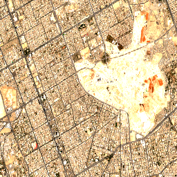

# Riyadh Heatmap AI

**Team:** Riyadh Heatmap Team  
**Theme:** Urban Development & Sustainability  
**PoC Summary:** A proof-of-concept decision-support platform that detects urban heat hotspots, analyzes urban expansion, and monitors cooling interventions in Riyadh using satellite data and Machine Learning.

## 1. The Business Use Case
- **User:** City planners, urban developers, and municipal authorities in Riyadh.
- **Decision:** Where to prioritize green infrastructure (tree planting) and cooling interventions, and how to zone new development to mitigate the urban heat island (UHI) effect.
- **Today's Tooling:** Infrequent ground-based temperature surveys and static census data, lacking real-time spatial granularity.

## 2. The Problem
Riyadh experiences extreme summer temperatures exacerbated by rapid urban expansion. This locked-in heat risk harms public health and increases energy costs. Satellite data provides the necessary continuous, high-resolution spatial coverage to track land cover changes and surface temperature, making it the perfect instrument for dynamic heat mapping.

## 3. Data Used
- **Copernicus Sentinel-2:** Level-2A surface reflectance data used for high-resolution NDVI vegetation mapping. (Licence: Copernicus Open Access)
- **Planet Tanager Hyperspectral:** urban and natural-lands STAC collections used for detailed spectral analysis of built-up vs. natural areas. (Licence: Planet open data/Hackathon specific)

## 4. Technical Approach
1.  **Data Ingestion:** Fetch and clip Sentinel-2 and Planet Tanager scenes over Riyadh.
2.  **Spectral Analysis:** Compute Normalized Difference Vegetation Index (NDVI) and Normalized Difference Built-up Index (NDBI) to distinguish vegetation from impervious surfaces.
3.  **Analytics:** Cross-reference land cover with thermal indicators to identify hotspots and historical urban expansion.
4.  **UI Visualization:** Render results dynamically via a Next.js (React-Leaflet) dashboard.

## 5. Installation
Requires Python 3.11.

```bash
git clone https://github.com/your-team/riyadh-heatmap-ai.git
cd riyadh-heatmap-ai
python -m venv .venv
source .venv/bin/activate  # On Windows: .venv\Scripts\activate
pip install -r requirements.txt
```

## 6. How to Run
```bash
jupyter lab notebooks/02_main_analysis.ipynb
```
Run all cells. The notebook will generate the required land use analysis. Expected runtime is approximately 3-4 minutes. At the end, it will produce an exported map showing the land cover changes and NDVI analysis.
Note: You must set the Copernicus API keys as environment variables if fetching new data.

## 7. Example Input and Output
- **Sample Input:** [data/sample_input/example_scene.tif](data/sample_input/example_scene.tif)
- **Sample Output:**  
  

## 8. Results and Limitations
- **Results:** Successfully identified the correlation between recent urban sprawl in Northern Riyadh and a localized increase in land surface temperatures (decreased NDVI).
- **Validation:** Cross-referenced against known historical urban boundaries.
- **Limitations:** Cloud cover can obscure data points in certain months. High-resolution hyperspectral data availability is currently limited to specific swaths, requiring interpolation for city-wide maps.

## 9. Team, Licence and Attribution
- **Team Members:** 
  - **Fatima Alhaddad**, Urban Planning Alternatives & Project Integration.
  - **Ghadeer Almadhoob**, Heat-Risk Modelling & Prediction.
  - **Hajar Majeedi**, GIS & Urban Expansion Analysis.
  - **Dana Husain**, Earth Observation & Data Acquisition.
  - **Jawad Alshakhahmed**, AI & Machine Learning Specialist.
- **Licence:** Apache 2.0
- **Attribution:** Built using Copernicus Sentinel data and Planet Tanager STAC catalog. Map interface built with React-Leaflet.
